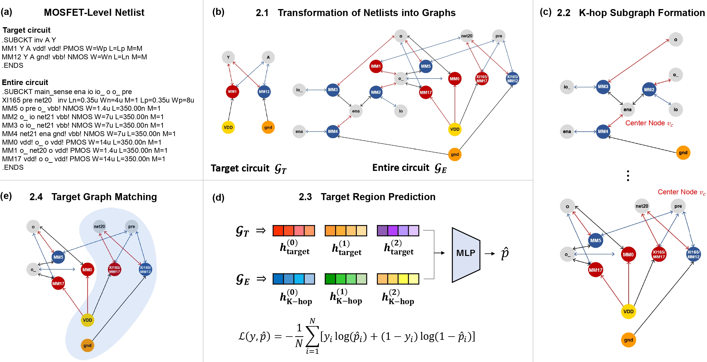

# Target Circuit Matching in Large-Scale Netlists using GNN-Based Region Prediction

## Model Architecture 


## abstract
Subgraph matching plays an important role in electronic design automation (EDA) and circuit analysis. 
Traditional rule-based methods have limitations in generalizing to arbitrary target circuits. Furthermore, node-to-node matching approaches tend to be computationally inefficient, particularly for large-scale circuits.
Deep learning methods have emerged as a potential solution to address these challenges, but existing models fail to efficiently capture global subgraph embeddings or rely on inefficient matching matrices, which limits their effectiveness for large circuits. In this paper, we propose an efficient graph matching approach that utilizes Graph Neural Networks (GNNs) to predict regions of high probability for containing the target circuit.
Specifically, we construct various negative samples to enable GNNs to accurately learn the presence of target circuits and develop an approach to directly extracting subgraph embeddings from the entire circuit, which captures global subgraph information and addresses the inefficiency of applying GNNs to all candidate subgraphs.
Extensive experiments demonstrate that our approach significantly outperforms existing methods in terms of time efficiency and target region prediction, offering a scalable and effective solution for subgraph matching in large-scale circuits.

## How to use
### Data Preparation Step
Netlist file must be placed under `circuit_project/raw_circuit/company/raw/`. The file extension format must be `.cir`

### Data Preprocessing Step
#### Parse large circuit file to subcircuits
This procedure generates individual subcircuit netlist file from large netlist file. Under circuit_preprocess directory, execute company_to_divided.py file with option `--filename YOUR_NETLIST_FILE_NAME`. This will create divided, individual netlists for each subcircuits under the directory `circuit_project/raw_circuit/company/`.

```console
(base) foo@bar:~/circuit_project$ conda activate CONDA_ENV
(CONDA_ENV) foo@bar:~/circuit_project$ cd circuit_preprocess
(CONDA_ENV) foo@bar:~/circuit_project/circuit_preprocess$ python3 company_to_divided.py --filename YOUR_NETLIST_FILE_NAME
```

#### Parse subcircuit netlist file
This procedure will parse netlist file and convert it to graph. The result will be stored under the directory `circuit_project/processed_circuit/company/graph_files/`. Execute company_preprocess.py with option `--gnd_vsource_directional --circuit SUBCIRCUIT_NAME_OF_INTEREST`. If you want to convert several subcircuit netlist to graphs, refer to `company_preprocess_all.sh`.

```console
(CONDA_ENV) foo@bar:~/circuit_project$ cd circuit_preprocess
(CONDA_ENV) foo@bar:~/circuit_project/circuit_preprocess$ python3 company_preprocess.py --gnd_vsource_directional --circuit SUBCIRCUIT_NAME_OF_INTEREST
```

### Model Training Step
#### Selecting Circuits to be used for training
In order to train classifier, you need to select target circuits and large circuits that includes the target circuit. 
User must manually write two files under `circuit_project/src/embedder_train_option/`. Each file must contain one line that contains circuit names of interest separated by a signle space.

For `train_targets.txt`, user must write target circuits to be found during training process
For `entire_circuits.txt`, user must write large circuits that include one or more target circuits. The large circuits will be used to generate samples.

#### Generating Training Samples
In order to train classifier, you need to create several k-hop subgraphs. This procedure will create several k-hop subgraphs (positive, mutation, partail, other_target, random) under the `circuit_project/processed_circuit/company/embedder_k_hop/` directory. Target circuits (train_targets.txt) in large circuits (entire_circuits) will be created as training sample. There are two ways to create training samples : automatical or manual.

For automatical generation, two files `train_targets.txt` and `entire_circuits.txt` will be used.
Execute main.py under the `circuit_project/src/` directory with option `--radius --gnd_vsource_directional --preprocess_data`
```console
(CONDA_ENV) foo@bar:~/circuit_project/src$ python3 main.py --gnd_vsource_directional --preprocess_data --radius
```

For manual generation, user can manualy define one target circuit and one entire circuit at a time. Execute main.py under the `circuit_project/src/` directory with option `--entire_circuit LARGE_CIRCUIT_OF_INTEREST --target_circuit YOUR_TARGET --radius --gnd_vsource_directional --manual_preprocess_data`
```console
(CONDA_ENV) foo@bar:~/circuit_project/src$ python3 main.py --entire_circuit LARGE_CIRCUIT_OF_INTEREST --target_circuit YOUR_TARGET --radius --gnd_vsource_directional --manual_preprocess_data
```
check for `circuit_project/script/create_k_hop_samples_manual.sh` for example. We recommend using automatical generation option.

#### Generating Training Splits

```console
(CONDA_ENV) foo@bar:~/circuit_project/src$ python3 main.py --entire_circuit LARGE_CIRCUIT_OF_INTEREST --target_circuit YOUR_TARGET --radius --gnd_vsource_directional --train_embedder --use_predefined_split
```


#### Test bounding box
```console
python3 main.py --entire_circuit atd1 --target_circuit delay10 --radius --gnd_vsource_directional --device 6 --load_parameter_file_name 168_20240902_105238
```
